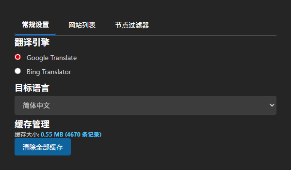
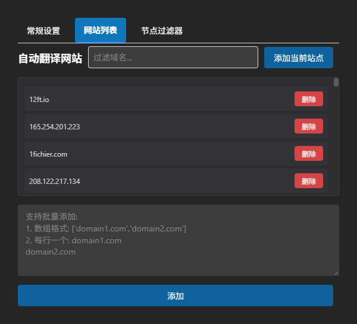
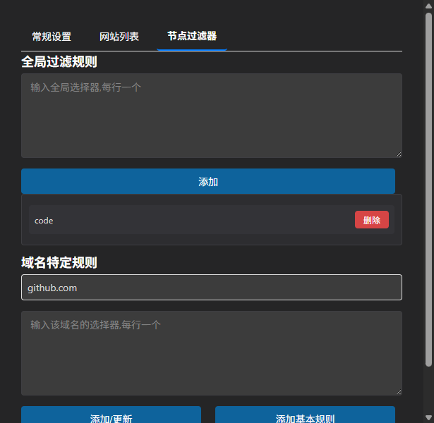

# 瞬译 (SwiftTrans) - 整页翻译扩展

[English](README_EN.md) | 中文

轻量级Chrome浏览器整页翻译扩展，支持Google和Bing翻译引擎。

## 功能特性

- 整页实时翻译，支持动态内容
- 双引擎支持：Google Translate、Bing Translator
- 智能缓存机制，提升翻译速度
- 域名白名单自动翻译
- 自定义节点过滤规则
- 右键菜单快速切换
- 支持25+种目标语言

## 快速开始

### 安装

1. 克隆或下载项目到本地
2. 打开Chrome浏览器，访问 `chrome://extensions/`
3. 启用右上角"开发者模式"
4. 点击"加载已解压的扩展程序"
5. 选择项目根目录

### 使用

- 右键菜单选择"翻译整页"/"恢复原文"切换翻译状态
- 右键菜单"自动翻译"将当前域名加入白名单
- 点击扩展图标打开设置页面配置选项

## 截图预览

## 核心模块

### background.js
Service Worker后台脚本，处理：
- 翻译API请求转发
- 右键菜单动态管理
- 标签页状态同步

### content.js
注入目标页面的内容脚本，负责：
- DOM节点收集与翻译
- MutationObserver监听动态内容
- 翻译状态管理

### lib/storage.js
封装Chrome Storage API：
- 配置持久化
- 翻译缓存管理
- 域名白名单管理

### lib/dom-processor.js
DOM处理核心类：
- TreeWalker遍历文本节点
- 过滤规则匹配
- 原文保存与恢复

## 配置说明

### 常规设置
- **翻译引擎**：Google Translate / Bing Translator
- **目标语言**：支持zh-CN、en、ja、ko等25+语言
- **缓存管理**：查看缓存大小，一键清除

### 网站列表
- 添加域名到自动翻译白名单
- 支持批量添加：数组格式或逐行输入
- 搜索过滤已添加域名

### 节点过滤器
- **全局规则**：应用于所有网站的CSS选择器
- **域名规则**：特定域名的过滤规则
- 默认规则：`.notranslate`、`[translate="no"]`、`code`

## 技术栈

- Manifest V3
- Chrome Extension APIs
- Vanilla JavaScript
- Chrome Storage API
- TreeWalker API
- MutationObserver API

## 开发

### 权限说明
- `storage`：配置和缓存存储
- `unlimitedStorage`：大容量翻译缓存
- `contextMenus`：右键菜单集成
- `host_permissions`：访问所有HTTP/HTTPS页面

### API端点
- Google Translate: `https://translate.google.com/translate_a/t`
- Bing Translator: `https://www.bing.com/translator/api/translate/v3`

## 许可证

请查看LICENSE文件

## 贡献

欢迎提交Issue和Pull Request